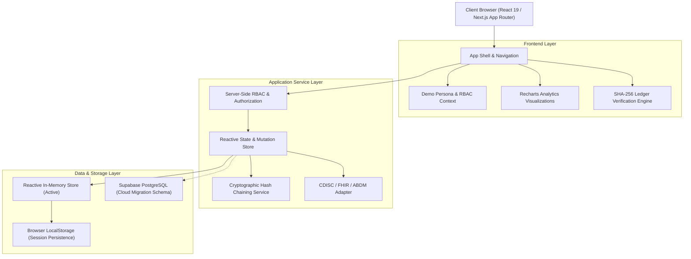
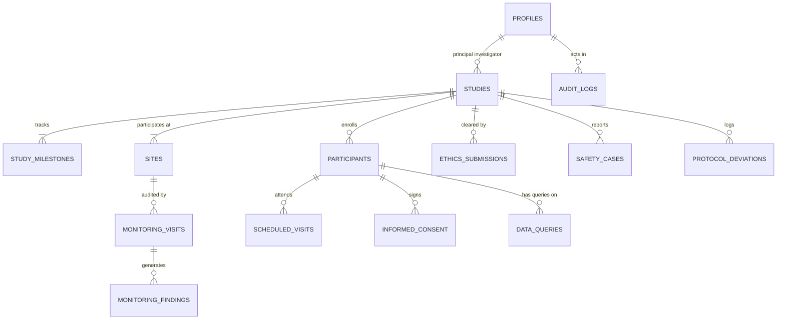

# AIIA Clinical Trial Management System — System Architecture

**Institution:** All India Institute of Ayurveda (AIIA), New Delhi  
**Ministry:** Ministry of Ayush, Government of India  
**Problem Statement:** SIH26046 (Smart India Hackathon 2026)  
**Security & Standard Framework:** GCP-ASU · ICMR 2017 · NDCT Rules 2019 · CDISC SDTM v3.3 · HL7 FHIR R4 · ALCOA+

---

## 1. High-Level Architectural Diagram

---

## 2. Entity-Relationship (ER) Diagram

---

## 3. ALCOA+ Cryptographic Hash Chain Mechanics

To satisfy **21 CFR Part 11**, **GCP-ASU**, and **ALCOA+** (*Attributable, Legible, Contemporaneous, Original, Accurate, Complete, Consistent, Enduring, Available*), the system implements an internal SHA-256 cryptographic hash-chain ledger:

$$\text{Hash}_0 = \text{0000000000000000000000000000000000000000000000000000000000000000}$$
$$\text{Hash}_N = \text{SHA256}(\text{Hash}_{N-1} \parallel \text{Seq}_N \parallel \text{Timestamp}_N \parallel \text{ActorID}_N \parallel \text{Action}_N \parallel \text{RecordType}_N \parallel \text{RecordID}_N \parallel \text{Details}_N)$$

### Tamper-Evidence Guarantee:
- Any modification to historical records alters $\text{Hash}_N$.
- Because block $N+1$ incorporates $\text{Hash}_N$ as its previous hash, altering any previous entry cascades an invalidation through all subsequent blocks.
- The on-screen **"Verify Cryptographic Chain Integrity"** button re-computes all hashes sequentially and visually validates the entire ledger.

---

## 4. CDISC SDTM & HL7 FHIR Interoperability Mapping

### A. CDISC SDTM Domains
1. **DM (Demographics):** Participant synthetic ID (`USUBJID`), Study ID (`STUDYID`), Site (`SITEID`), Age (`AGE`), Sex (`SEX`), Race (`RACE`), Treatment Arm (`ARM`).
2. **AE (Adverse Events):** Event description (`AETERM`), Severity (`AESEV`), Seriousness (`AESER`), Causality (`AEREL`), Outcome (`AEOUT`).
3. **EX (Exposure):** Investigational ASU Formulation name (`EXTRT`), Dose (`EXDOSE`), Unit (`EXDOSU`), Dosage Form (`EXDOSFRM`), Lot (`EXLOT`).
4. **VS (Vital Signs):** Test Code (`VSTESTCD`), Test Name (`VSTEST`), Result (`VSORRES`), Units (`VSORRESU`), Visit (`VISIT`).
5. **LB (Laboratory Tests):** Analyte (`LBTESTCD`), Test Name (`LBTEST`), Measured value (`LBORRES`), Unit (`LBORRESU`).

### B. HL7 FHIR R4 Resources
- `ResearchStudy`: Models the trial protocol, phase, sponsor, and primary endpoints.
- `ResearchSubject`: Models the de-identified participant linked to the `ResearchStudy`.
- `AdverseEvent`: Models safety events with WHO-UMC causality assessments and Ayush classical diagnosis extensions.

---

## 5. Security & Privacy Framework

1. **Role-Based Access Control (RBAC):** Server-side authorization matrix enforces least-privilege principles across 7 roles.
2. **Zero PHI Exposure:** Synthetic IDs (`DEMO-XXXX`) are utilized exclusively. Direct patient identifiers (names, addresses, telephone numbers) are isolated.
3. **Audit Trail Immutability:** Audit records are write-once, append-only, and protected by foreign key constraints and RLS policies.
